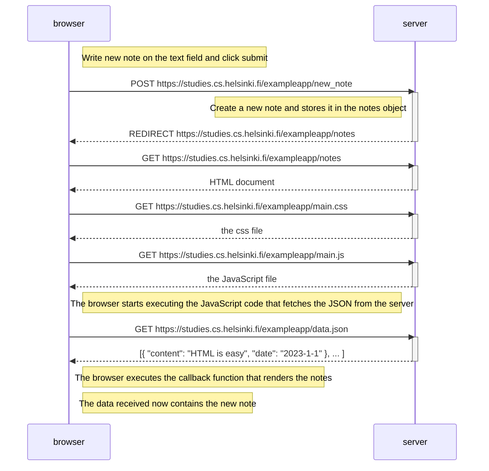

```mermaid
sequenceDiagram
    participant b as browser
    participant s as server

    Note right of b: Write new note on the text field and click submit
    b->>s: POST https://studies.cs.helsinki.fi/exampleapp/new_note
    activate s
    Note left of s: Create a new note and stores it in the notes object
    s-->>b: REDIRECT https://studies.cs.helsinki.fi/exampleapp/notes
    deactivate s

    b->>s: GET https://studies.cs.helsinki.fi/exampleapp/notes
    activate s
    s-->>b: HTML document
    deactivate s

    b->>s: GET https://studies.cs.helsinki.fi/exampleapp/main.css
    activate s
    s-->>b: the css file
    deactivate s

    b->>s: GET https://studies.cs.helsinki.fi/exampleapp/main.js
    activate s
    s-->>b: the JavaScript file
    deactivate s

    Note right of b: The browser starts executing the JavaScript code that fetches the JSON from the server

    b->>s: GET https://studies.cs.helsinki.fi/exampleapp/data.json
    activate s
    s-->>b: [{ "content": "HTML is easy", "date": "2023-1-1" }, ... ]
    deactivate s

    Note right of b: The browser executes the callback function that renders the notes
    Note right of b: The data received now contains the new note
```