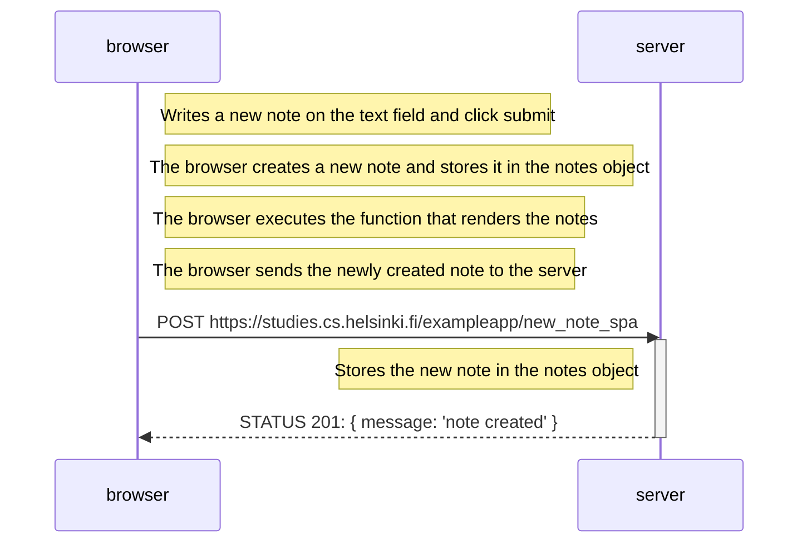

```mermaid
sequenceDiagram
    participant b as browser
    participant s as server

    Note right of b: Writes a new note on the text field and click submit
    Note right of b: The browser creates a new note and stores it in the notes object
    Note right of b: The browser executes the function that renders the notes
    Note right of b: The browser sends the newly created note to the server
    b->>s: POST https://studies.cs.helsinki.fi/exampleapp/new_note_spa
    activate s
    Note left of s: Stores the new note in the notes object
    s-->>b: STATUS 201: { message: 'note created' }
    deactivate s
```